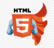

- 👋 Hi, I’m @BolterBait
- 👀 I’m interested in life
- 🌱 I’m currently learning JavaScript
- 💞️ I’m looking to collaborate on ...
- 📫 How to reach me osvyatobog@gmail.com

<h2>Stack and tools I use:</h2>

<!---
BolterBait/BolterBait is a ✨ special ✨ repository because its `README.md` (this file) appears on your GitHub profile.
You can click the Preview link to take a look at your changes.
--->
